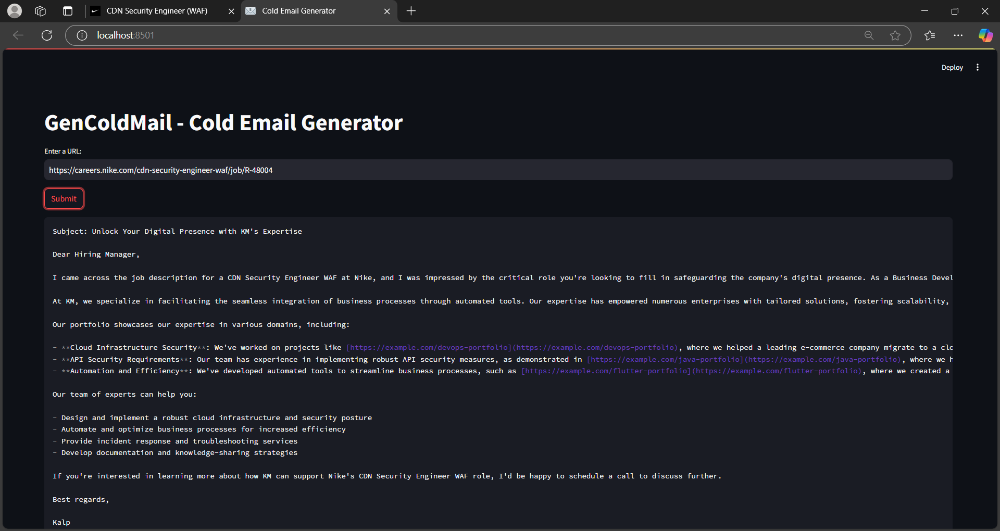

# GenColdMail
GenColdMail - Cold email generator for services company using groq, langchain and streamlit. It allows users to input the URL of a company's careers page. The tool then extracts job listings from that page and generates personalized cold emails. These emails include relevant portfolio links sourced from a vector database, based on the specific job descriptions. 

s

## Set-up

1. To get started, first install the dependencies using:
    ```commandline
     pip install -r requirements.txt
    ```
   
2. Run the streamlit app:
   ```commandline
   streamlit run app/main.py
   ```